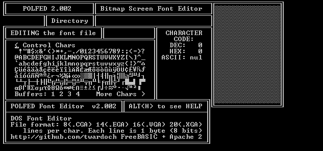

# POLFED32.EXE

**Bitmap screen font editor for DOS text-mode fonts.**

Opens and saves a simple bitmap format: depending on file extension, each glyph is 8 (.CGA), 14 (.EGA), 16 (.VGA), 20 (.XGA) pixels (lines/bytes) tall, and 8 pixels (1 byte/8 bits) wide. Has 4 built-in clipboard buffers for copy-paste, allows glyph shifting and mirroring, has a pattern-making function, and a really primitive UI. 

I wrote the editor in 1994 because I thought I needed a Cyrillic font for my DOS. I didn’t have one, so I decided to make such a Cyrillic DOS font myself. Since I didn’t have a suitable editor, I wrote one. Once I finished writing the editor, I no longer needed the Cyrillic font, so I never made any single font with the app. I’m publishing the app here for no other reason than my vanity and nostalgia. :) 



Usage:
```
POLFED32.EXE INPUT.EXT [OUTPUT.EXT]
```
Example:
```
POLFED32.EXE DOSFONT.VGA DOSFONT1.VGA
```

Originally written in 1994 in QBasic, then in 1998 in Visual Basic for DOS, rewritten in 2015 using [FreeBasic](http://www.freebasic.net/). The repository contains `POLFED32.BAS`, the source code of the current version written in FreeBasic. To build, use `fbc -lang qb POLFED32.BAS`. It also contains `POLFED32.EXE`, a version that runs under Windows (in command line mode). For historical purposes, it also contains an older version `POLFED16.EXE` which is written in Visual Basic for DOS and runs in DOS mode only. 

Copyright © 1994-2015 by Adam Twardoch. Published under the [Apache 2](/LICENSE) license at http://github.com/twardoch . 
